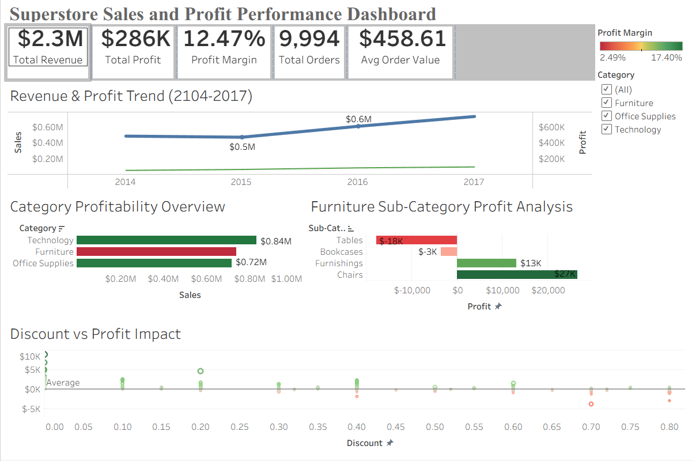

# superstore sales and profit analysis

**Project Overview:**
This project analyzes sales performance and profitability using the Superstore dataset. The goal is to understand revenue trends, identify loss-making product segments, and evaluate how discount strategies impact business profitability. SQL was used for data exploration and analysis, while Tableau was used to build an interactive dashboard for visualizing insights.

**Objectives:**
- Analyze overall sales and profit performance
- Identify profitable and loss-making product categories
- Evaluate sub-category performance
- Understand the relationship between discount and profit
- Build an interactive dashboard to present business insights

**Dataset:**
The dataset contains transactional sales data from a retail superstore including order details, product information, and financial metrics.

Total records analyzed: 9994

**Technologies Used:**
- SQL (MySQL)
- Tableau

**Exploratory Data Analysis:**
SQL queries were used to explore and analyze the dataset.

Key analysis included:
- Yearly sales and profit trends
- Category level profitability
- Sub-category loss analysis
- Discount distribution and its impact on profit

Visualizations were created to support the analysis.



**Tableau Dashboard:**
An interactive Tableau dashboard was built to analyze business performance and identify key insights.

Dashboard components include:
- Executive KPI overview
- Revenue and profit trend (2014–2017)
- Category profitability comparison
- Furniture sub-category loss analysis
- Discount vs Profit relationship

The dashboard provides a clear overview of sales performance and highlights factors affecting profitability.

---

**Key Insights:**
- Total revenue reached **$2.3M** with a **12.47% profit margin**
- Sales increased steadily between **2014 and 2017**
- **Furniture category shows lower profitability compared to other categories**
- **Tables and Bookcases generate consistent losses**
- High discounts often result in negative profit

---

**Business Insights:**
- High discount strategies significantly impact profit margins
- Furniture sub-categories require pricing or cost optimization
- Technology products contribute higher profitability
- Monitoring discount strategies can improve overall profitability

---
```
│
├── data
│ ├── raw
│ │ └── superstore_raw.csv
│ │
│ └── cleaned
│ └── superstore_cleaned.csv
│
├── sql
│ └── sales_analysis_queries.sql
│
├── dashboard
│ └── superstore_dashboard.twb
│
├── images
│ └── dashboard_preview.png
│
└── README.md
```
